# Dental Lead Qualifier - Workflow Schema

## Mermaid Flowchart

```mermaid
flowchart TD
    A[📨 SLACK WEBHOOK<br/>Node 1<br/>Receive message events] --> B[📋 EXTRACT LEAD DATA<br/>Node 2<br/>Parse name, email, phone, country]

    B --> C{🔍 FILTER<br/>Node 4<br/>Valid format?}
    C -->|No| D[⏭️ LOG SKIPPED<br/>Node 5<br/>Log reason + return 200]
    C -->|Yes| E[👥 HUBSPOT CHECK<br/>Node 3<br/>Search by email]

    E --> F[📝 BUILD PROMPT<br/>Node 9<br/>Lead data + criteria]

    F --> G[🤖 CLAUDE CODE + GLM<br/>Node 10<br/>Web search + AI scoring]

    G --> H{Error?}
    H -->|Yes| I[❌ LOG ERROR<br/>Node 11<br/>Log + notify Slack]
    H -->|No| J[📊 UPDATE STATS<br/>Node 12<br/>Count qualified/ko/spam]

    J --> K[👥 HUBSPOT UPDATE<br/>Node 13<br/>Set status if exists]
    K --> L[💬 FORMAT MESSAGE<br/>Node 14<br/>Emoji + score + reasoning]
    L --> M[📤 SLACK REPLY<br/>Node 15<br/>Post result]

    style A fill:#4A154B,color:#fff
    style B fill:#5c5c5c,color:#fff
    style C fill:#FF6B6B,color:#fff
    style D fill:#95a5a6,color:#fff
    style E fill:#ff7a59,color:#fff
    style F fill:#5c5c5c,color:#fff
    style G fill:#7c3aed,color:#fff
    style H fill:#FF6B6B,color:#fff
    style I fill:#e74c3c,color:#fff
    style J fill:#5c5c5c,color:#fff
    style K fill:#ff7a59,color:#fff
    style L fill:#5c5c5c,color:#fff
    style M fill:#4A154B,color:#fff
```



## Data Flow Summary

```
Slack Event → Extract → HubSpot Check → Build Prompt → Claude AI → Update HubSpot
                                              │               │
                                              ▼               ▼
                                        Web Search      Format Result
                                                        (with emoji status)
                                                              │
                                                              ▼
                                                        Reply to Slack
```

## Node Reference

| Node | Function | API Used |
|------|----------|----------|
| 1 | Webhook receiver | Slack Event API |
| 2 | Parse message | Regex patterns |
| 3 | Check existing contact | HubSpot CRM API |
| 4 | Filter invalid leads | - |
| 5 | Log skipped leads | Activity log |
| 9 | Build AI prompt | - |
| 10 | AI qualification + web search | Claude Code CLI + GLM |
| 11 | Error handling | - |
| 12 | Statistics tracking | - |
| 13 | Update contact status | HubSpot CRM API |
| 14 | Format response | - |
| 15 | Send reply | Slack Chat API |

## JSON Output Format

```json
{
  "is_dentist": true,
  "profile_type": "Dentiste",
  "score": 85,
  "qualified": true,
  "reasoning": "Found on Doctolib + professional email domain"
}
```

## Profile Types

| Type | Description |
|------|-------------|
| `Dentiste` | Confirmed dental professional (qualified) |
| `Autre` | Related but not dentist (lab, supplier, student) |
| `SPAM` | Invalid, fake, or irrelevant lead |

## Scoring Rules

| Score Range | Status |
|-------------|--------|
| 70-100 | ✅ QUALIFIED (hot lead) |
| 40-69 | ⚠️ POSSIBLE (needs verification) |
| 0-39 | ❌ UNQUALIFIED or SPAM |

## Scoring Breakdown

| Criteria | Points |
|----------|--------|
| Name found in dentist search results | +40 |
| Email contains dental-related terms | +30 |
| Professional email domain | +20 |
| Complete contact info (phone + email) | +10 |

## Trusted Sources for Dentist Verification

- Doctolib
- Ordre des Chirurgiens-Dentistes
- sante.fr
- ameli.fr
